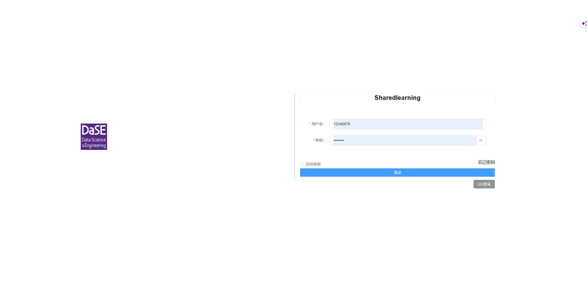
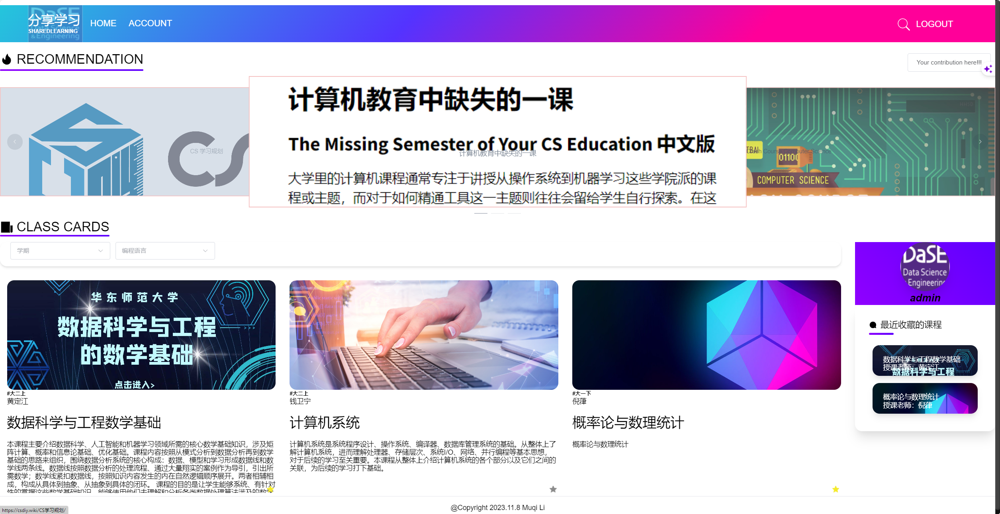
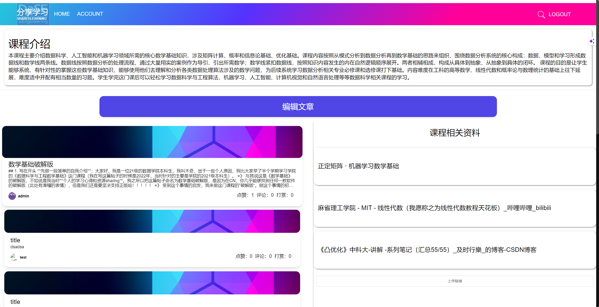

# sharedlearning

This project, built as a full-stack web application using Spring Boot and Vue 3, aims to enhance self-learning experiences for undergraduates by fostering collaborative and shared learning environments.


## 1. Project Overview

login:




home:




course: 

> For each course page, you can access comprehensive information by clicking on the article card on the left as well as the external link on the right. This feature enables a more in-depth understanding of the course, providing valuable knowledge for users.




## 2. How to use 

```sh
git clone git@github.com:Muqi1029/sharedlearning.git

cd sharedlearning/frontendsl

npm i # to install modules of frontend

npm run serve # start server of frontend
```

To set up your database, utilize the provided SQL file and configuration file in the BackendSL directory. Once configured, you can initiate the backend server directly.


