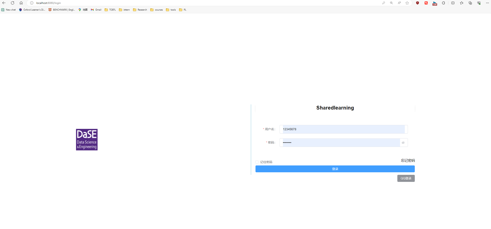

# sharedlearning

This project, built as a full-stack web application using Spring Boot and Vue 3, aims to enhance self-learning experiences for undergraduates by fostering collaborative and shared learning environments.

# 项目概览

如今，大学课堂教学普遍存在一些问题，例如教授在课程中机械地阅读PPT或者布置过时或缺乏实际价值的项目作业。这种教学方式并未有效地促进大学生的知识获取和能力培养，同时，大学的教学内容与工业界对学生的期望之间存在较大差距。

为解决这些问题，本项目以学院为基本单元，构建了一个综合性的学习资源共享平台。尽管项目与现有的教学计划相互依附，但并不受其限制。鉴于大学生需要完成强制性课程以获得学分，我们采用课内和课外相结合的方式。以课程内容为分类，平台汇集了来自网络的高质量学习资源，并包括一些学长学姐的经验建议。这种设计使得学生能够逐渐掌握课程的主动学习权，摆脱单一教学方式的束缚。如果学生认为某位老师的教学方式不适合自己，他们可以依赖该平台找到更适合自己学习风格的资源，更好地完成课程并锻炼个人能力。

该平台不仅仅关注课程学习资源，还包含了大学生生活的各个方面。例如，学长学姐可以分享学习规划的建议，校友则提供社会工作的指导，包括社交、求职、科研等主题。最终，该平台的目标是实现全方位的学习资源共享，为学生提供更丰富的学习和生活经验。

## 项目功能

### 登录

如图所示，用户在使用本项目前必须先通过密码登录，以确保只有授权用户能够访问网站的功能。这一设计旨在防止未授权的个人窃取网站资源或对其进行攻击。

### 主页

如图所示，页面主要由一系列顶部的标签栏构成，下方则展示了一些共享的推荐资源。这些资源并不受限于特定课程内容，旨在为用户提供个性化的服务。紧随其后，设计了一便捷的课程搜索功能，使学生能够根据学期筛选课程并查看当前学期的所有课程卡片。每个课程卡片提供了基本信息，并允许用户通过点击进入相关课程界面。此外，学生还可通过点击卡片右下方的星号将课程收藏，被收藏的课程将立即显示在右侧，以方便用户在之后迅速访问。

### 课程界面

点击某一课程卡片后，用户将进入课程主页，如图所示。主页顶部展示了简要的课程介绍，而页面下半部分包括了编辑文章按钮，允许任何用户发表对课程的看法和学习建议。底部则呈现了一个文章列表，显示了每篇文章的作者信息。用户可以对这些文章进行点赞、评论和打赏。

右侧区域呈现了与该课程相关的课外资源，包括笔记、其他名校的公开课等。用户可以点击这些资源，跳转至对应的网页。值得注意的是，用户也有权上传属于自己的资源，经过审核后即可在该页面显示。这一设计旨在为用户提供更丰富的学习体验，并促进共享学习资源的互动与分享。

### 文章界面

通过点击课程界面左栏的任意一篇文章卡片，用户将进入一个类似于图所示的界面。在该界面左侧，文章的具体内容以Markdown形式进行渲染，而右侧则列出了文章的小标题。用户可以通过点击这些小标题，快速跳转至文章中的不同部分，以便更方便地浏览和定位所需信息。这一设计旨在提供更直观、交互式的文章阅读体验。

### 编辑文章

点击课程界面上的编辑文章按钮将跳转至该课程的文章编辑界面，如图所示。用户可以在这个界面中进行文字编写、图片粘贴以及示例代码的编辑，并且支持匿名发布。一旦用户完成编辑，经过管理员审核后，文章将最终以课程界面的一个文章卡片的形式展示出来。这一设计旨在为用户提供一个方便的编辑平台，促进内容的丰富与分享。

### 管理员

在登录界面，如果输入的是管理员身份的账号密码，则系统将跳转至管理员界面（图所示），而普通用户则会被引导至首页界面。在管理员界面，管理员具备对用户的封禁权限，同时可以进行用户上传链接和文章的审核。仅经过管理员审核通过的内容才会在网站上显示，供普通用户浏览。这一设计旨在维护网站内容的质量和安全性，确保用户能够获得受信任的信息。

## 相关技术

### 后端

- 基础框架：SpringBoot
- ORM框架：MybatisPlus
- 其他技术：详见后端项目的pom.xml

### 前端

- 基本框架：vue3
- 网络请求：axios
- 状态管理：pinia
- 路由组件: vue-router
- 其他技术：详见前端项目中的package.json

## 项目特色

### 技术上

- 用户登录时创建特有的token，保证用户登录的安全
- 本项目采用SPA架构，拥有更流程的用户体验、更好的性能，同时减少服务器的负担
- 本项目采用前后端分离的开发方式，拥有更好的灵活性和可维护性，也会使得系统更容易拓展。例如可以增加更多的前端实例，而无需改变后端逻辑。这有助于系统更好地适应变化和应对不断增长的用户需求。

### 立意上

本项目旨在将破除传统老旧的教学模式，将课程的主动权逐渐流向学生主体，而不是完全由教授掌控。同时将学习资源根据课程分类，帮助学生在“义务性”地完成教学计划课程的同时，提升学生的学习体验和提供学生充足的学习资源，以便更好地学习知识和得到锻炼，以面临未来潜在的学术、工作的挑战！

同时用户可以自主上传学习资源和匿名地发表文章，经过审核后即可真正发布，这本身就是集聚了大家共有的力量，也是share的力量。同时随着课程开设的次数增多，相关课程的学习资源可以在学生群体中反复迭代更新，这是传承，也是与时俱进！

除了正常的课程学习资源外，项目还对人生规划，学习规划等课外知识以链接卡片的形式在界面上的推荐部分展示。始于课程学习资源，但不终于学习资源，未来可以增设大学生所需要的任何知识板块，来提升大学的教学质量和提升学生自己的学习体验，做到sharedlearning！

## 不足与展望

目前，项目已建立了基本的网站框架，但仍存在一些尚未完善的功能，例如在线编辑器无法上传文章，缺乏对文章进行点赞和打赏等功能。值得注意的是，网站尚未正式上线。

鉴于项目仍有许多提升空间，我诚挚地邀请对该项目感兴趣的人一同参与完善。我们的目标是共同努力提高大学教学质量和学生学习体验。

如您对此项目有兴趣并愿意为之贡献，欢迎通过以下联系方式与我取得联系：

- 作者邮箱：muqi1029@gmail.com
- GitHub地址：[https://github.com/Muqi1029/sharedlearning](https://github.com/Muqi1029/sharedlearning)

期待您的加入，共同打造一个更加完善和有益的学习资源共享平台。

